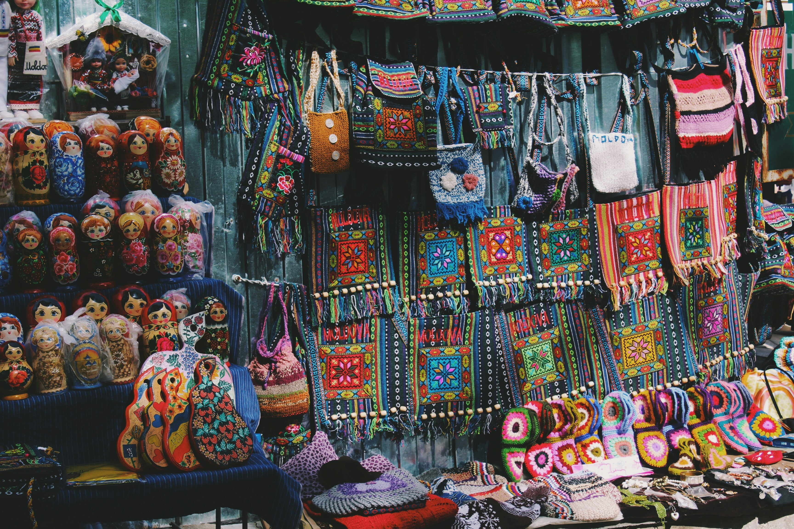

# Streamlit App: Moldova's Progress
A Streamlit app that one can use to explore **key indicators of Moldova's development**.  
Access the first version of the app [here](https://moldova-indicators.streamlit.app/).

## Goal
This project aims to help people learn about Moldova's close history and how it has developed over time.
I'm told many times **"You're the first Moldovan I've met!"** or often encounter questions like **"What language do you speak?"** or **"Why is Moldova poor?"**. 

With this app, users can explore and discover answers on their own.

Moldova is currently in the process of seeking membership in the European Union, a development that needs to be paid attention to.

*Photo by [Alina Grubnyak](https://unsplash.com/@alinnnaaaa) on Unsplash*

### Roadmap
This project will go through different phases, and the roadmap might change through time.

**1. World Bank Perspective**
1. Add parent indicator level as a button. (*IN PROGRESS*)
3. Add basic information on Moldova. (*NEXT*)

**2. Moldovan Perspective**
   1. Define other key indicators from Moldovan sources. (*BACKLOG*)
   2. Add plots on key indicators from Moldovan sources. (*BACKLOG*)
